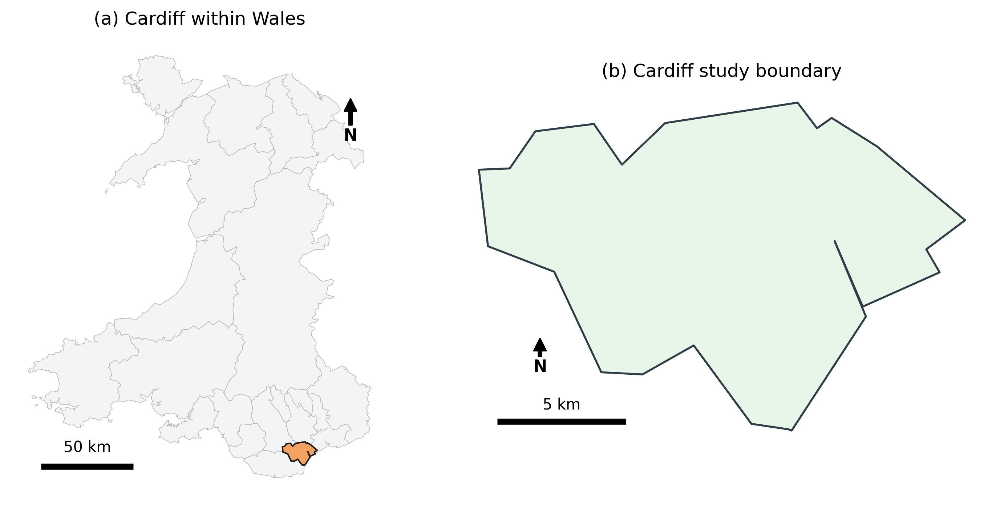

# Evaluating K-means Clustering and Gradient Boosting for Five-Class Land-Cover Mapping in Cardiff Using Sentinel-2 Imagery

## A Sentinel-2 Case Study using K-means Clustering and Gradient Boosting

This project presents a GEOL0069 AI4EO project focused on five-class land-cover classification in **Cardiff, Wales**, using Sentinel-2 satellite imagery. It compares two machine-learning approaches: **K-means clustering**, a supervised method that groups pixels by spectral similarity, and **Gradient Boosting**, an unsupervised method trained with ESA WorldCover-derived reference labels.

The analysis uses a Sentinel-2 Level-2A surface reflectance composite, including visible, near-infrared and short-wave infrared bands, together with NDVI and NDBI. These features are used to classify Cardiff into five land-cover classes: Urban, Tree and shrub, Water, Open land / Bare, and Grass and crop.

Both models use the same Sentinel-2 feature stack, allowing differences in the final maps to be interpreted mainly as the result of modelling strategy rather than differences in input data. The project evaluates model accuracy, mapped class area, spatial agreement, limitations, and the environmental cost of the workflow.


<details open>
<summary><strong>Table of Contents</strong></summary>

1. [Research Question](#research-question)
2. [Project Motivation and Problem Description](#project-motivation)
3. [Study Area](#study-area)
4. [Data Sources and Pre-processing](#data-sources-and-pre-processing)
5. [Method Overview](#method-overview)
   - [K-means Workflow](#k-means-workflow)
   - [Gradient Boosting Workflow](#gradient-boosting-workflow)
6. [Results and Comparison](#results-and-comparison)
   - [Accuracy Comparison](#accuracy-comparison)
   - [Mapped Class Area](#mapped-class-area)
   - [Spatial Agreement](#spatial-agreement)
7. [Discussion and Limitations](#discussion-and-limitations)
8. [Environmental Cost](#environmental-cost)
9. [Walk-through Video](#walk-through-video)
10. [Repository Structure](#repository-structure)
11. [Reproducibility](#reproducibility)
12. [References](#references)

</details>

---

## Research Question

**To what extent can Sentinel-2 spectral bands and vegetation/built-up indices distinguish Cardiff’s urban, water, tree/shrub, grass/crop, and open/bare land-cover classes using unsupervised K-means clustering and supervised Gradient Boosting?**

The project uses five target classes:

| Class ID | Class name |
|---:|---|
| 1 | Urban |
| 2 | Tree and shrub |
| 3 | Water |
| 4 | Open land / Bare |
| 5 | Grass and crop |

---

## Project Motivation and Problem Description

Urban land-cover classification is challenging because many surface types occur close together and are often mixed within a single Sentinel-2 pixel. In Cardiff, a 20 m pixel may contain buildings, roads, gardens, trees, grass, water edges, bare soil, or shadows. These mixed pixels can make different land-cover classes appear spectrally similar, especially for Urban, Open land / Bare, and Grass and crop.

The project tackles the problem of whether Sentinel-2 spectral bands, NDVI, and NDBI can distinguish five broad land-cover classes: Urban, Tree and shrub, Water, Open land / Bare, and Grass and crop. It also tests whether two different machine-learning approaches produce similar or different interpretations of the same landscape.

This comparison is useful because the two methods answer different questions. **K-means** asks whether pixels naturally group into meaningful spectral clusters without using labels. **Gradient Boosting** asks whether Sentinel-2 features can reproduce a labelled WorldCover-derived class scheme. Comparing the two helps identify which classes are spectrally separable and which remain uncertain in Cardiff’s mixed urban environment.


---

## Study Area

The study area is **Cardiff, Wales**, defined using a Cardiff boundary GeoJSON. The project also uses a Wales district boundary layer for the location context map.

Cardiff is suitable for this project because it contains a strong mixture of built-up land, managed green space, woodland, agricultural edges, rivers, lakes, docks, and coastal water. This creates a realistic AI4EO classification problem where class boundaries are often mixed and uncertain at 20 m resolution.



---

## Data Sources and Pre-processing

The workflow uses **Google Earth Engine** to access and process satellite and reference data directly. The main inputs are:

| Dataset | Earth Engine ID / file | Purpose |
|---|---|---|
| Sentinel-2 Level-2A surface reflectance | `COPERNICUS/S2_SR_HARMONIZED` | Main optical satellite feature source |
| ESA WorldCover v200 | `ESA/WorldCover/v200` | Reference labels for supervised learning and evaluation |
| Cardiff boundary | `data/selection.geojson` | Study area mask |
| Wales district boundary | `data/district_boundary.geojson` | Context map |

The Sentinel-2 feature stack contains six spectral bands and two derived indices:

| Feature | Meaning |
|---|---|
| B2 | Blue |
| B3 | Green |
| B4 | Red |
| B8 | Near infrared |
| B11 | Short-wave infrared 1 |
| B12 | Short-wave infrared 2 |
| NDVI | Normalised Difference Vegetation Index |
| NDBI | Normalised Difference Built-up Index |

A growing-season Sentinel-2 composite is used to strengthen the contrast between vegetation, built-up surfaces, water, and open/bare areas. Cloud-contaminated and invalid pixels are removed before creating the modelling arrays. The analysis is run at a **20 m** working scale to balance spatial detail and Google Colab runtime stability. At this scale, each pixel represents **400 m²**, which is used for mapped area calculations.


### WorldCover Remapping

The original ESA WorldCover classes are remapped into the five target classes:

| WorldCover class | Cardiff target class |
|---|---|
| Built-up | Urban |
| Tree cover, shrubland | Tree and shrub |
| Permanent water bodies | Water |
| Bare / sparse vegetation | Open land / Bare |
| Grassland, cropland, herbaceous wetland, moss/lichen | Grass and crop |
| Snow/ice, mangroves, no data | Ignored |

The WorldCover labels are treated as **reference labels**, not perfect ground truth. This is important because WorldCover can contain uncertainty in mixed urban areas, narrow rivers, small green spaces, construction sites, and land-cover transition zones.

---

## Method Overview

Both classification methods use the same Sentinel-2 feature stack. This means that differences between outputs are mainly caused by the modelling approach.

K-means is used as an unsupervised spectral baseline. It groups pixels according to similarity in the eight-dimensional Sentinel-2 feature space, and the resulting clusters are interpreted using spectral profiles, NDVI, NDBI, SWIR response, visible brightness, and map inspection.

Gradient Boosting is used as the supervised classifier. It learns relationships between Sentinel-2 features and WorldCover-derived five-class labels, then predicts a land-cover class for every valid pixel in the Cardiff study area.

---

## K-means Workflow

K-means clustering is fitted to a standardised sample of valid Sentinel-2 pixels. The final model uses **k = 5** so that the unsupervised output can be interpreted against the same five-class scheme used by the supervised model. Diagnostic plots are included as sensitivity checks rather than as an automatic model-selection rule.


### K-means Diagnostics

The elbow and silhouette plots show how clustering behaviour changes across candidate `k` values. The chosen value of `k = 5` is retained because it matches the five target land-cover classes and supports direct comparison with Gradient Boosting.


### K-means Cluster Interpretation

K-means cluster IDs are arbitrary and do not automatically mean Urban, Water, Tree and shrub, or any other class. Therefore, the raw clusters are interpreted using cluster spectral profiles and map inspection.


The final interpreted K-means output maps Cardiff into the five target classes.


---

## Gradient Boosting Workflow

Gradient Boosting uses the same Sentinel-2 feature stack but is trained using the remapped WorldCover reference labels. A train/test split is used to evaluate model agreement with the reference labels before the model is applied to all valid pixels.


The Gradient Boosting map should be interpreted as a supervised, label-driven classification. It is not independent field validation because the reference labels come from WorldCover.


---

## Results and Comparison

The results compare model agreement with WorldCover-derived labels, mapped class area, and spatial agreement between the two methods.

### Accuracy Comparison

Because K-means is unsupervised, the raw cluster IDs were not evaluated directly. Instead, the clusters were matched to the five WorldCover-derived reference classes before calculating agreement metrics. This avoids treating arbitrary cluster numbers as fixed land-cover labels.

| Model | Overall accuracy | Cohen's kappa |
|---|---:|---:|
| K-means matched | 0.34 | 0.06 |
| Gradient Boosting | 0.31 | 0.08 |


The results show that neither method achieved strong agreement with the WorldCover-derived labels. K-means matched had slightly higher overall accuracy, while Gradient Boosting had slightly higher Cohen's kappa. This suggests that Sentinel-2 features capture some broad land-cover structure, but the five-class scheme remains difficult to separate in a mixed urban environment.

### Gradient Boosting Evaluation

The Gradient Boosting confusion matrix shows that the model struggles to separate several classes, particularly Urban, Tree and shrub, Open land / Bare, and Grass and crop. Water is more distinct in the test set, but the final full-map prediction still needs careful interpretation because small water bodies, shadowed vegetation, and dark urban surfaces can overlap spectrally.


### Mapped Class Area

The mapped area comparison shows that the two models assign very different proportions of Cardiff to each class.

| Class | K-means (%) | Gradient Boosting (%) | Difference, GB - K-means (pp) |
|---|---:|---:|---:|
| Urban | 4.0 | 28.9 | +24.9 |
| Tree and shrub | 27.4 | 22.7 | -4.7 |
| Water | 2.4 | 0.0 | -2.4 |
| Open land / Bare | 37.3 | 24.9 | -12.4 |
| Grass and crop | 28.8 | 23.5 | -5.3 |


These differences show that the two methods interpret the same Sentinel-2 feature space in different ways. K-means maps much more Open land / Bare and less Urban, while Gradient Boosting maps more Urban because it is guided by WorldCover-derived labels.


### Spatial Agreement

The spatial agreement analysis shows where K-means and Gradient Boosting predict the same class and where they disagree.


Agreement is low across all classes, especially Water. This reflects the fact that K-means and Gradient Boosting are not interchangeable: K-means follows spectral similarity, while Gradient Boosting follows the reference-label scheme.


---

## Discussion and Limitations

### What the Results Show

The results suggest that Sentinel-2 spectral bands, NDVI, and NDBI can separate some broad land-cover patterns in Cardiff, but they do not fully distinguish all five target classes with high reliability. The low accuracy and kappa values show that agreement with WorldCover-derived labels is limited.

This does not mean that the classification is useless. Rather, it shows that Cardiff is a difficult classification environment because land-cover types are spatially mixed and spectrally overlapping at 20 m resolution.

### Value of K-means

K-means is useful because it exposes the natural spectral structure of Cardiff without using labels. The spectral profile plot shows clear differences between water-like, vegetation-like, and brighter/built or open-surface clusters.

However, K-means is not automatically a land-cover classifier. Its class names depend on post-hoc interpretation using spectral profiles and map inspection. This makes it useful for understanding spectral ambiguity, but weaker as a final thematic land-cover product.

### Value of Gradient Boosting

Gradient Boosting provides a supervised, label-driven classification. Its advantage is that it produces named classes directly and can learn non-linear relationships between Sentinel-2 features and reference labels.

However, the model depends strongly on the quality of WorldCover-derived labels. If the reference labels are noisy, too general, or misaligned with the Sentinel-2 composite, the model can learn uncertain class boundaries. The confusion matrix shows this problem clearly.

### Ambiguous Surfaces in Cardiff

The most difficult surfaces are Urban, Open land / Bare, and Grass and crop. Bright roofs, concrete, dry grass, bare soil, car parks, construction areas, and sparsely vegetated land can have similar visible and SWIR reflectance. Residential pixels may also contain buildings, roads, gardens, trees, and shadows within the same 20 m pixel.

This mixed-pixel problem is especially important in Cardiff because dense urban areas, suburban housing, parks, agricultural edges, river corridors, and dockland occur close together.

### Limitations

The main limitations are:

- WorldCover labels are reference data, not field-validated ground truth.
- The five-class scheme simplifies a complex urban landscape.
- The 20 m working scale creates mixed pixels in residential and urban-edge areas.
- K-means class labels require subjective interpretation.
- Gradient Boosting inherits uncertainty from the reference labels.
- A single seasonal composite may not capture seasonal differences between grassland, cropland, woodland, bare soil, and urban surfaces.

Future work could improve the classification by using manually labelled validation points, Sentinel-1 radar data, multi-season Sentinel-2 composites, higher-resolution imagery, texture features, or object-based classification.

---

## Environmental Cost

The environmental cost assessment estimates the direct computational footprint of the notebook using measured stage runtimes. It does not include the upstream cost of satellite construction, satellite launch, Google Earth Engine infrastructure, data storage, or repeated exploratory runs during development.

The workflow uses CPU-only classical machine learning and no GPU. This helps keep the computational footprint low.

| Quantity | Value |
|---|---:|
| Total measured runtime | 97.99 s |
| Total measured runtime | 1.633 min |
| Energy use | 0.001633 kWh |
| CO2e | 0.2042 g |
| Estimated electricity cost | £0.000403 |
| Assumed active notebook power | 0.060 kW |
| Carbon intensity | 0.125 kg CO2e/kWh |
| Electricity price | £0.2467/kWh |
| GPU used | No |


The largest runtime contribution came from Gradient Boosting prediction and mapping, followed by K-means clustering and Google Earth Engine pre-processing. Overall, the direct computational cost of this workflow is very small because it uses moderate-resolution Sentinel-2 data, sampled classical machine learning, and no deep learning.

---

## Walk-through Video

A short project walk-through video should explain:

1. The research question and why Cardiff was selected.
2. The Sentinel-2 and WorldCover data sources.
3. The five-class remapping scheme.
4. The K-means workflow and cluster interpretation.
5. The Gradient Boosting workflow and evaluation.
6. The key results: low agreement, strong model disagreement, and class-area differences.
7. The limitations and environmental cost assessment.

Video link: **add your YouTube or OneDrive link here**

---

## Repository Structure

```text
GEOL0069-Cardiff-LandCover-Classification/
|-- Cardiff_LandCover__GEOL0069.ipynb
|-- README.md
|-- requirements.txt
|-- data/
|   |-- selection.geojson
|   |-- district_boundary.geojson
|-- figures/
|   |-- study_area_cardiff.png
|   |-- cardiff_sentinel2_rgb.png
|   |-- kmeans_workflow_cardiff.png
|   |-- kmeans_diagnostics_cardiff.png
|   |-- kmeans_raw_clusters_cardiff.png
|   |-- kmeans_cluster_profiles_cardiff.png
|   |-- kmeans_five_class_map_cardiff.png
|   |-- gradient_boosting_workflow_cardiff.png
|   |-- gradient_boosting_confusion_matrix_cardiff.png
|   |-- gradient_boosting_five_class_map_cardiff.png
|   |-- gradient_boosting_area_chart_cardiff.png
|   |-- model_accuracy_comparison_cardiff.png
|   |-- class_area_comparison_cardiff.png
|   |-- model_spatial_agreement_cardiff.png
|   |-- class_specific_agreement_cardiff.png
|   |-- environmental_cost_summary_cardiff.png
```

---

## Reproducibility

The notebook is designed to run in **Google Colab**.

### 1. Install dependencies

```bash
pip install -r requirements.txt
```

### 2. Authenticate Google Earth Engine

```python
import ee
ee.Authenticate()
ee.Initialize(project="your-earth-engine-project-id")
```

### 3. Place boundary files in the data folder

The notebook expects:

```text
data/selection.geojson
data/district_boundary.geojson
```

### 4. Run the notebook

Open and run:

```text
Cardiff_LandCover__GEOL0069.ipynb
```

The notebook will create figures and intermediate outputs in the project folder. If you use a different Google Drive folder, update the project paths near the start of the notebook.

---

## Requirements

The core Python packages are:

```text
earthengine-api
geemap
geopandas
shapely
rasterio
numpy
pandas
matplotlib
scikit-learn
scipy
```

---

## References

Chuvieco, E. (2016). *Fundamentals of satellite remote sensing: An environmental approach* (2nd ed.). CRC Press. https://doi.org/10.1201/b19478

GeeksforGeeks. (2025). *Gradient boosting in ML*. https://www.geeksforgeeks.org/machine-learning/ml-gradient-boosting/

GeeksforGeeks. (2026). *K means clustering – Introduction*. https://www.geeksforgeeks.org/machine-learning/k-means-clustering-introduction/

Google Earth Engine Data Catalog. (n.d.). *ESA WorldCover 10m v200*, `ESA/WorldCover/v200`. https://developers.google.com/earth-engine/datasets/catalog/ESA_WorldCover_v200

Google Earth Engine Data Catalog. (n.d.). *Harmonized Sentinel-2 MSI: MultiSpectral Instrument, Level-2A (SR)*, `COPERNICUS/S2_SR_HARMONIZED`. https://developers.google.com/earth-engine/datasets/catalog/COPERNICUS_S2_SR_HARMONIZED

Google Earth Engine Data Catalog. (n.d.). *Sentinel-2: Cloud Probability*, `COPERNICUS/S2_CLOUD_PROBABILITY`. https://developers.google.com/earth-engine/datasets/catalog/COPERNICUS_S2_CLOUD_PROBABILITY

Gorelick, N., Hancher, M., Dixon, M., Ilyushchenko, S., Thau, D., & Moore, R. (2017). Google Earth Engine: Planetary-scale geospatial analysis for everyone. *Remote Sensing of Environment, 202*, 18–27. https://doi.org/10.1016/j.rse.2017.06.031

Quick Map Tools. (n.d.). *Download administrative boundaries*. https://www.quickmaptools.com/download-boundaries

Rouse, J. W., Jr., Haas, R. H., Schell, J. A., & Deering, D. W. (1974). Monitoring vegetation systems in the Great Plains with ERTS. In *Proceedings of the Third Earth Resources Technology Satellite-1 Symposium* (NASA SP-351, Vol. 1, pp. 309–317). NASA. https://ui.adsabs.harvard.edu/abs/1974NASSP.351..309R/abstract

scikit-learn developers. (n.d.). *HistGradientBoostingClassifier*. scikit-learn. https://scikit-learn.org/stable/modules/generated/sklearn.ensemble.HistGradientBoostingClassifier.html

scikit-learn developers. (n.d.). *KMeans*. scikit-learn. https://scikit-learn.org/stable/modules/generated/sklearn.cluster.KMeans.html

scikit-learn developers. (n.d.). *Silhouette score*. scikit-learn. https://scikit-learn.org/stable/modules/generated/sklearn.metrics.silhouette_score.html

scikit-learn developers. (n.d.). *Silhouette score*. scikit-learn. https://scikit-learn.org/stable/modules/generated/sklearn.metrics.silhouette_score.html

Zha, Y., Gao, J., & Ni, S. (2003). Use of normalized difference built-up index in automatically mapping urban areas from TM imagery. *International Journal of Remote Sensing, 24*(3), 583–594. https://doi.org/10.1080/01431160304987
